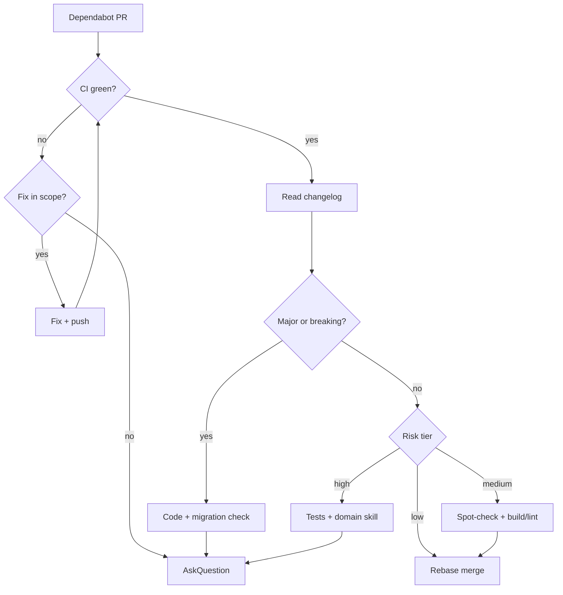

# Review Dependabot PRs

Workflow for FMC geo React apps. Dependabot **config** (groups, schedule, ignores) lives in skill `tech-stack` — [dependabot.md](../tech-stack/references/dependabot.md). This skill covers **review and merge decisions**.

After merge, use skill `babysit` only if the PR needs conflict/CI/comment follow-up on a feature branch — not for routine weekly bumps on `develop`.

## Repos and cadence

| Repo                                                              | Typical base | Notes                                                    |
| ----------------------------------------------------------------- | ------------ | -------------------------------------------------------- |
| [tilda-geo](https://github.com/FixMyBerlin/tilda-geo/pulls)       | `develop`    | Monorepo: `/app`, `/processing`                          |
| [trassenscout](https://github.com/FixMyBerlin/trassenscout/pulls) | `develop`    | Same as tilda-geo — never merge Dependabot PRs to `main` |

Policy: **one open Dependabot PR per ecosystem** — merge or explicitly defer (close + ignore) before the next opens.

## Review workflow

Copy and track:

```
- [ ] Identify PR type (security / grouped patch / major / actions / docker)
- [ ] Read release notes in PR description (and linked changelog)
- [ ] Classify risk (see below)
- [ ] Scan lockfile + manifest diff for surprises
- [ ] Confirm CI green on latest commit
- [ ] Run extra local checks if risk ≥ medium
- [ ] Merge with rebase, or AskQuestion / defer
```

### 1. Gather context

```bash
gh pr view <number> --repo FixMyBerlin/<repo> --json title,body,baseRefName,headRefName,mergeable,statusCheckRollup,author,labels
gh pr diff <number> --repo FixMyBerlin/<repo> --name-only
```

Read the PR body first — Dependabot embeds release notes and compare links. Follow **breaking change**, **migration**, and **deprecation** sections before reading code.

Note **group name** in the title (e.g. `app-framework-minor-patch`) — a single PR may bundle many packages; one risky changelog can block the whole group.

### 2. Classify risk

| Tier                  | Examples                                                                                                                  | Action                                                                                                                                  |
| --------------------- | ------------------------------------------------------------------------------------------------------------------------- | --------------------------------------------------------------------------------------------------------------------------------------- |
| **Low**               | Patch dev tools (`knip`, `husky`), typings, isolated utilities                                                            | CI green → merge                                                                                                                        |
| **Medium**            | Grouped minor/patch framework deps, `vite`, `oxlint`/`oxfmt`, Playwright                                                  | Read changelogs; spot-check usage; `bun run build` + `bun oxlint` locally if notes mention behavior changes                             |
| **High**              | `react`, `@tanstack/*`, `maplibre-gl`, `react-map-gl`, `prisma`, `better-auth`, `zod`, `tailwindcss`, `typescript` majors | Full changelog + migration guide; grep codebase for affected APIs; run build, lint, unit tests; Playwright if maps/auth/routing touched |
| **Critical decision** | Semver **major**, explicit breaking changes, peer-dep conflicts, CI red, or changelog unclear                             | **AskQuestion** — do not merge until human chooses                                                                                      |

Security updates: treat as **medium** minimum — still read notes; do not merge blind even when labeled security.

### 3. Investigate in code

When changelog or tier says investigate:

1. `gh pr diff` — focus on `package.json`, `bun.lock`, not only lockfile noise.
2. Grep for APIs mentioned in breaking sections (deprecated props, renamed exports, config keys).
3. Load the relevant FMC skill if the bump touches that area (`react-dev`, `react-map-gl`, `tanstack-start-conventions`, `playwright-skill`, etc.).
4. Check **peer dependency** warnings in CI logs.

**browserslist** bumps: Dependabot does not change the browserslist query — but lockfile may refresh `caniuse-lite`. After merge, ensure `bun oxlint` and `bun run build` still pass ([browser-target.md](../tech-stack/references/browser-target.md)).

**GitHub Actions** bumps: prefer grouped minor/patch; verify action release notes for runner/input renames; workflow must stay compatible with org secrets and `permissions`.

**Docker** bumps: monthly base images — check OS/package changes; rebuild locally if the app ships containers.

### 4. When to use AskQuestion

Use Cursor **AskQuestion** when the agent cannot safely decide alone:

- Semver **major** for any production or framework dependency
- Breaking change affects code paths you cannot fully verify in session
- CI fails and fix is not obvious or would widen scope beyond the bump
- Grouped PR mixes safe and risky packages — merge all vs split vs close and reconfigure groups
- Changelog missing or contradictory
- Proposed **ignore** rule vs taking the update now
- Merge vs wait for a sibling PR / upstream fix

Present concrete options, e.g. merge after local build, close and add `ignore`, or defer until next week.

### 5. Merge

Requirements:

- All required checks **success**
- Risk tier handled per table above
- No unresolved review threads that block merge

**Use rebase merge** to keep history linear:

```bash
gh pr merge <number> --repo FixMyBerlin/<repo> --rebase --delete-branch
```

If the repo disallows rebase via CLI, use the GitHub UI with **Rebase and merge**.

Do **not** squash Dependabot PRs — preserve one commit per dependency bump for easier bisect.

After merge on `develop`, no further action unless CI on the base branch fails (then treat as a hotfix follow-up).

### 6. Defer instead of merging

Close without merging when:

- Major needs dedicated migration time
- Group is too large to review in one pass
- Known upstream regression (link issue in PR comment)

Prefer adding a targeted `ignore` in `.github/dependabot.yml` (document why in PR comment) over leaving the PR open — remember `open-pull-requests-limit: 1` blocks the queue.

Config changes: follow skill `tech-stack` [dependabot.md](../tech-stack/references/dependabot.md).

## Quick decision flow



## What not to do

- Do not merge with failing required checks “to unblock the queue”
- Do not refactor app code in the same session as a routine Dependabot merge unless the bump **requires** it
- Do not change CI workflows to make a bad bump pass — flag instead
- Do not batch-merge multiple open Dependabot PRs without reviewing each (limit should be 1 per ecosystem anyway)

## Related skills

| Skill              | When                                                           |
| ------------------ | -------------------------------------------------------------- |
| `tech-stack`       | dependabot.yml, groups, ignores, browserslist                  |
| `babysit`          | Feature PR stuck on CI/comments — not standard Dependabot flow |
| `playwright-skill` | After bumps to Playwright, maps, or auth-related deps          |
