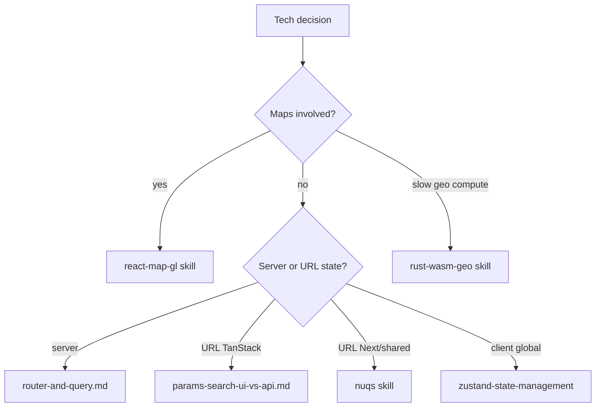

# FMC tech stack

Default stack for **geo-heavy React SPAs** at FixMyBerlin / FMC. Use for tech decisions when **creating** or **changing** an app — not as a deep dive into any one library.

Install sibling skills separately: `bunx skills add FixMyBerlin/fixmyskills --skill <name> -a cursor -y`

## When to apply

- Greenfield app scaffold (dependencies, tooling, folder layout)
- Library or pattern choice (“should we use X?”)
- Cross-cutting convention review on an existing app

## LLM resources

Load [references/llm-resources.md](references/llm-resources.md) **only for the area the task touches**.

**Maps:** load skill `react-map-gl` (and upstream [React Map GL docs](https://visgl.github.io/react-map-gl/) when the skill points there).

## Specialized skills

Prefer installed skill names when present; otherwise fetch from git.

| Area                                     | Skill                        | GitHub                                                                                                                         |
| ---------------------------------------- | ---------------------------- | ------------------------------------------------------------------------------------------------------------------------------ |
| Rust/WASM geo                            | `rust-wasm-geo`              | <https://github.com/FixMyBerlin/fixmyskills/tree/main/skills/rust-wasm-geo>                                                    |
| Maps (react-map-gl)                      | `react-map-gl`               | <https://github.com/FixMyBerlin/fixmyskills/tree/main/skills/react-map-gl>                                                     |
| React TS patterns, useEffect discipline  | `react-dev`                  | <https://github.com/FixMyBerlin/fixmyskills/tree/main/skills/react-dev>                                                        |
| TanStack Start (layout, boundaries, SSR) | `tanstack-start-conventions` | <https://github.com/FixMyBerlin/fixmyskills/tree/main/skills/tanstack-start-conventions>                                       |
| Router search params (UI routes)         | —                            | <https://github.com/FixMyBerlin/fixmyskills/blob/main/skills/tanstack-start-conventions/references/params-search-ui-vs-api.md> |
| Router + Query loaders                   | —                            | <https://github.com/FixMyBerlin/fixmyskills/blob/main/skills/tanstack-start-conventions/references/router-and-query.md>        |
| Devtools debug panel                     | —                            | <https://github.com/FixMyBerlin/fixmyskills/blob/main/skills/tanstack-start-conventions/references/devtools.md>                |
| URL state (Next.js / shared libs)        | `nuqs`                       | <https://github.com/FixMyBerlin/fixmyskills/tree/main/skills/nuqs>                                                             |
| Client global state                      | `zustand-state-management`   | <https://github.com/FixMyBerlin/fixmyskills/tree/main/skills/zustand-state-management>                                         |
| E2E / Playwright                         | `playwright-skill`           | <https://github.com/FixMyBerlin/fixmyskills/tree/main/skills/playwright-skill>                                                 |
| Next → Start migration                   | `tanstack-start-migration`   | <https://github.com/FixMyBerlin/fixmyskills/tree/main/skills/tanstack-start-migration>                                         |

## Runtime and build

- **Runtime / package manager:** [Bun](https://bun.sh)
- **Build:** latest Vite (8+)
- **Bun security:** `minimumReleaseAge = 5` in `bunfig.toml` (432000 seconds)
- **Lint / format:** oxlint and oxfmt with fix flags; Prettier-compatible defaults:
  - class sorting, import sorting, `package.json` sorting
  - `printWidth` 100, semicolons `asNeeded`, single quotes
  - `'typescript/switch-exhaustiveness-check': 'error'`
  - Templates: [examples/oxfmt.config.mjs](examples/oxfmt.config.mjs), [examples/oxlint.config.mjs](examples/oxlint.config.mjs)
  - Setup and per-project tuning: [references/oxc-config.md](references/oxc-config.md)
- **Client browser target:** `browserslist` in `package.json` drives Vite client `build.target` and `eslint-plugin-compat` in oxlint — [references/browser-target.md](references/browser-target.md)

## React and TypeScript

- **UI:** React 19
- **TypeScript:** Go-native **7.x** (`typescript@7.0.1-rc`, binary `tsc`). Typecheck with `tsc --noEmit`.
- **Bun + TS 7:** add `typescript` and `@typescript/typescript-*` platform packages to `minimumReleaseAgeExcludes` while on RC. Bun may not hoist optional platform binaries — list `@typescript/typescript-darwin-arm64` and `@typescript/typescript-linux-x64` under `optionalDependencies` (extend for other CI/dev platforms as needed).
- **React Compiler:** on by default — see skill `react-dev` for memoization and typing conventions
- **GeoJSON:** `@types/geojson` for all GeoJSON payloads
- **Dates / times:** `@date-fns/tz`
- **Validation:** Zod 4

### tsconfig templates

Use **two profiles** — do not merge app and scripts into one config.

| Profile                   | Template                                                         | Profile analogue                  |
| ------------------------- | ---------------------------------------------------------------- | --------------------------------- |
| App (DOM, TanStack Start) | [examples/tsconfig.app.json](examples/tsconfig.app.json)         | total-typescript `bundler/dom`    |
| Scripts (CLI, no DOM)     | [examples/tsconfig.scripts.json](examples/tsconfig.scripts.json) | total-typescript `bundler/no-dom` |

Copy and adapt on scaffold. Adjust `paths` to project layout (`./src/*` vs `./*`). Add `allowJs: true` only when the repo still has `.js` files.

**TanStack Start (app only):** `verbatimModuleSyntax: false` — type-only imports can become empty runtime imports and leak server code into client bundles. See header comments in `tsconfig.app.json`.

**Never** install or `extends` `@total-typescript/tsconfig` — keep settings inlined with deviation comments.

**Typecheck:**

```bash
tsc --noEmit -p tsconfig.app.json && tsc --noEmit -p tsconfig.scripts.json
```

Single-config repos (e.g. one root `tsconfig.json` covering app + scripts) are acceptable; greenfield TanStack Start apps should prefer split configs.

Optional root `tsconfig.json` with `"references"` to both child configs.

**ES2025:** `target` and `lib` stay in sync. `lib` adds typings only; new ES2025 **runtime** APIs in client bundles are not auto-polyfilled — use deliberately on the client; fine on server/Bun/scripts. Which browsers get that client bundle: [references/browser-target.md](references/browser-target.md).

Component typing, Compiler, oxlint React rules, and useEffect discipline: skill `react-dev`. Map camera, clicks, and layers: skill `react-map-gl` (not `useEffect` + `map.on()`).

## Data and state

| Need                                        | Choice                                                                                                                                                                                        |
| ------------------------------------------- | --------------------------------------------------------------------------------------------------------------------------------------------------------------------------------------------- |
| Server / async data                         | TanStack Query — no raw `useEffect` fetch; Suspense where the router supports it                                                                                                              |
| Forms (non-trivial)                         | TanStack Form                                                                                                                                                                                 |
| Routing                                     | TanStack Router / Start                                                                                                                                                                       |
| Shareable URL state (TanStack apps)         | Route `validateSearch` (Zod) — see [params-search-ui-vs-api.md](https://github.com/FixMyBerlin/fixmyskills/blob/main/skills/tanstack-start-conventions/references/params-search-ui-vs-api.md) |
| Shareable URL state (Next.js / shared libs) | nuqs — see skill `nuqs`                                                                                                                                                                       |
| Global client state                         | Zustand (tkdodo patterns) — skill `zustand-state-management`                                                                                                                                  |
| Local UI state                              | `useState`                                                                                                                                                                                    |

Loader + Query integration: [router-and-query.md](https://github.com/FixMyBerlin/fixmyskills/blob/main/skills/tanstack-start-conventions/references/router-and-query.md).

## Styling and UI

- **CSS:** Tailwind CSS, `@tailwindcss/forms`, `@tailwindcss/typography`
- **Class merging:** `tailwind-merge` with `twJoin`, `twMerge`
- **Fonts:** Fontsource imports
- **Accessibility:** semantic HTML; keyboard-accessible map controls; do not rely on color alone

## Maps and geo (JS)

Stack choices only — map component patterns, layers, events, URL viewport: skill `react-map-gl`.

| Choice          | Default                                                                                                                                                                                                                  |
| --------------- | ------------------------------------------------------------------------------------------------------------------------------------------------------------------------------------------------------------------------ |
| Library         | `react-map-gl/maplibre` (not raw MapLibre in components)                                                                                                                                                                 |
| Basemap         | [OpenFreeMap](https://openfreemap.org/); Maptiler if required                                                                                                                                                            |
| Coordinates     | WGS84, `[lng, lat]` at API boundaries; validate with Zod                                                                                                                                                                 |
| Turf            | `@turf/*` per-function imports — not `import * as turf`                                                                                                                                                                  |
| Feature editing | [tilda-geo drawing](https://github.com/FixMyBerlin/tilda-geo/tree/develop/app/src/components/regionen/pageRegionSlug/Map/Calculator/drawing), [maplibre-gl-terradraw](https://github.com/watergis/maplibre-gl-terradraw) |

## Rust / WASM geo

Turf vs WASM, crates, Vite wiring: skill `rust-wasm-geo`.

## Dependency updates (Dependabot)

- Weekly Monday 07:00 Europe/Berlin; **one open PR at a time** per ecosystem (`open-pull-requests-limit: 1`).
- Template: [examples/dependabot.yml.template](examples/dependabot.yml.template)
- Grouping, monorepo tuning, and ignores: [references/dependabot.md](references/dependabot.md)
- **Reviewing and merging PRs:** skill `review-dependabot` (changelog triage, risk tiers, rebase merge)

## CI (GitHub Actions)

- PR dependency review: permissive `allow-licenses` (not deprecated `deny-licenses`) — template: [examples/ci.yml.template](examples/ci.yml.template)

## Tests and quality

| Need                            | Skill / tool             |
| ------------------------------- | ------------------------ |
| Unit / component tests          | Vitest (always)          |
| Cross-route, map, or auth flows | `playwright-skill`       |
| Pure logic / utils only         | Vitest — skip Playwright |

## Quick decisions


