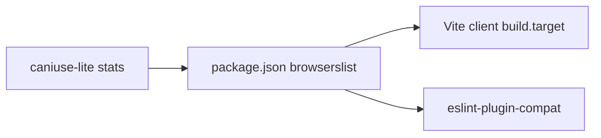

# Client browser target

`package.json` `browserslist` is the **single source of truth**. Three layers read it:



| Layer                                       | Role                                             | Reads browserslist?                |
| ------------------------------------------- | ------------------------------------------------ | ---------------------------------- |
| `browserslist` queries                      | Which browser versions we support                | —                                  |
| `caniuse-lite` (via `browserslist` npm pkg) | Market-share data                                | Feeds query resolution             |
| Vite `build.target`                         | Transpile **syntax** (`?.`, `async/await`, etc.) | Yes, via `browserslist-to-esbuild` |
| `eslint-plugin-compat`                      | Guard **Web APIs** in client code                | Yes, natively                      |
| Polyfills (`core-js`, etc.)                 | Shim missing runtime APIs                        | Only if you add them               |
| Server code (`*.server.ts`, Nitro/Bun)      | Node/Bun APIs                                    | No — unrestricted                  |

**Syntax** → Vite transpiles. **New built-in methods** (`Set.prototype.union`, etc.) → check compat lint / MDN vs resolved target. **Server** → use modern Bun/Node freely.

---

## Current config (tilda-geo `app/`)

### `package.json` — queries + direct dependency

`browserslist` is a **direct devDependency** so Dependabot weekly bumps refresh `caniuse-lite` data.

```json
{
  "devDependencies": {
    "browserslist": "^4.24.0",
    "browserslist-to-esbuild": "^2.1.1",
    "eslint-plugin-compat": "^7.0.2"
  },
  "browserslist": ["> 1%", "last 2 versions", "not dead", "not op_mini all", "not kaios > 0"]
}
```

Query semantics:

- **`> 1%`** — versions with ≥1% global usage (includes mobile when they cross the threshold)
- **`last 2 versions`** — two latest releases per browser (keeps Firefox/others current)
- **`not dead`** — drop browsers without support for 24+ months
- **`not op_mini all`, `not kaios > 0`** — exclude low-capability mobile browsers

Browserslist has **no per-platform threshold** (e.g. “30% of iOS users”). Stats are global. For site-specific audiences: `> X in my stats` with [custom usage data](https://github.com/browserslist/browserslist#custom-usage-data).

### `vite.config.ts` — client build target only

```ts
import browserslistToEsbuild from 'browserslist-to-esbuild'

export default defineConfig({
  environments: {
    client: {
      build: {
        target: browserslistToEsbuild(),
        sourcemap: true,
      },
    },
  },
})
```

Server/SSR env is unaffected.

### `oxlint.config.mjs` — client API guard

Scoped to browser-shipped code. Server files excluded — they run on Bun/Nitro. See also [oxc-config.md](oxc-config.md).

```js
{
  files: ['src/components/**', 'src/routes/**'],
  excludeFiles: ['**/*.server.ts', '**/*.functions.ts', 'src/routes/api/**'],
  jsPlugins: [{ name: 'compat', specifier: 'eslint-plugin-compat' }],
  rules: {
    'compat/compat': 'error',
  },
},
```

---

## Policy

- **No blanket polyfills** — add a targeted polyfill only when compat lint flags an API you need
- **CSS** — Tailwind v4 targets a similar baseline; review hand-written CSS against MDN/Baseline in review
- **After caniuse updates** (Dependabot or manual) — rerun `bun oxlint` and `bun run build`; resolved minimums may shift

---

## Inspect resolved targets

From `app/`:

```bash
bunx browserslist
bun -e "import b from 'browserslist-to-esbuild'; console.log(b())"
```

Example esbuild output shape: `["chrome112", "edge143", "firefox146", "ios18.5", "safari26.2"]` — exact values change as caniuse stats update.

---

## Changing support level

1. Edit `browserslist` queries in `app/package.json` (not Vite defaults in isolation)
2. Run inspect commands above
3. Run `bun oxlint` and `bun run build`
4. Fix or triage any new `compat/compat` findings

Common query tweaks:

```json
"> 0.5%"
"> 1% in alt-EU"
"last 2 Chrome versions, last 2 Firefox versions, last 2 ios_saf versions, last 2 and_chr versions, not dead"
```

Avoid orphaned CRA-era blocks like `"last 2 IE major versions"` — nothing in the Vite stack reads them unless wired.

---

## Dependabot

[tilda-geo `.github/dependabot.yml`](https://github.com/FixMyBerlin/tilda-geo/blob/develop/.github/dependabot.yml) runs weekly Bun updates on `/app`. Direct deps `browserslist`, `eslint-plugin-compat`, and `browserslist-to-esbuild` get patch/minor PRs; lockfile pulls fresh `caniuse-lite` with `browserslist` bumps.

Dependabot does **not** edit the `browserslist` query array — only humans change that. General Dependabot policy: [dependabot.md](dependabot.md).

---

## Reference implementation (tilda-geo)

| File                                                                                                   | Purpose                             |
| ------------------------------------------------------------------------------------------------------ | ----------------------------------- |
| [`app/package.json`](https://github.com/FixMyBerlin/tilda-geo/blob/develop/app/package.json)           | Queries + direct `browserslist` dep |
| [`app/vite.config.ts`](https://github.com/FixMyBerlin/tilda-geo/blob/develop/app/vite.config.ts)       | Client `build.target`               |
| [`app/oxlint.config.mjs`](https://github.com/FixMyBerlin/tilda-geo/blob/develop/app/oxlint.config.mjs) | `compat/compat` override            |
